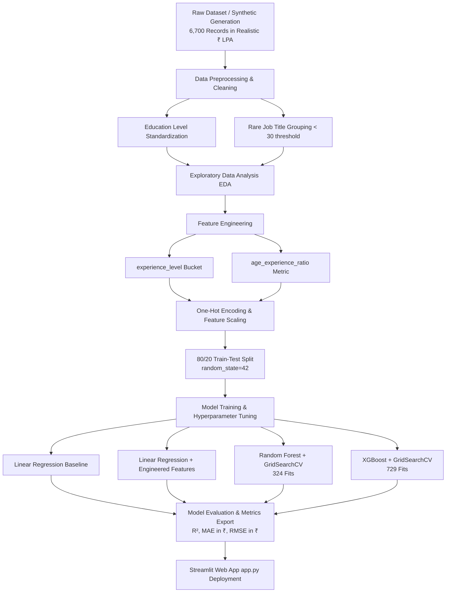

# 💰 Salary Predictor Pro: End-to-End Machine Learning & Analytics Dashboard

[](https://www.python.org/)
[](https://streamlit.io/)
[](https://scikit-learn.org/)
[](https://xgboost.ai/)
[](https://pandas.pydata.org/)
[](LICENSE)

An end-to-end Machine Learning solution designed to assist **Human Resources (HR) and Talent Acquisition teams** in determining competitive, fair, data-driven, and bias-aware salary offers benchmarked to the **Indian Job Market in Rupees (₹ / LPA)**. The project encompasses synthetic dataset generation matching real-world Indian salary distributions, comprehensive Exploratory Data Analysis (EDA), domain-specific Feature Engineering, hyperparameter-tuned predictive modeling (Linear Regression, Random Forest, XGBoost), and an interactive multi-tab **Streamlit Web Application**.

---

## 📋 Table of Contents

1. [Executive Summary & Business Objectives](#-executive-summary--business-objectives)
2. [Interactive Streamlit Web Dashboard](#-interactive-streamlit-web-dashboard)
3. [Project Architecture & Machine Learning Pipeline](#-project-architecture--machine-learning-pipeline)
4. [Dataset Specifications](#-dataset-specifications)
5. [Exploratory Data Analysis (EDA)](#-exploratory-data-analysis-eda)
6. [Feature Engineering Deep-Dive](#-feature-engineering-deep-dive)
7. [Machine Learning Models & Hyperparameter Tuning](#-machine-learning-models--hyperparameter-tuning)
8. [Performance Evaluation & Benchmark Results](#-performance-evaluation--benchmark-results)
9. [Key Business Takeaways & HR Recommendations](#-key-business-takeaways--hr-recommendations)
10. [Project Directory Structure](#-project-directory-structure)
11. [Installation & Setup Guide](#-installation--setup-guide)
12. [Deployment Guide (Streamlit Cloud)](#-deployment-guide-streamlit-cloud)
13. [Submission Verification Checklist](#-submission-verification-checklist)
14. [License & Acknowledgments](#-license--acknowledgments)

---

## 🎯 Executive Summary & Business Objectives

### Problem Statement
In modern talent acquisition, manual compensation decisions often suffer from inconsistency, lack of benchmarking data, and unconscious bias regarding demographic or educational background. HR departments need an automated, data-driven tool to estimate fair baseline market salaries based on objective candidate attributes: **Age, Gender, Education Level, Job Title, and Years of Experience**.

### Business Value Proposition
- **Standardized Compensation in INR (₹ / LPA)**: Eliminates arbitrary salary offers by providing statistical compensation ranges in Indian Rupees derived from 6,700 candidate records.
- **Pay Equity & Bias Awareness**: Evaluates compensation models across demographics to ensure equal pay for equal experience and education.
- **Data-Driven Hiring Offers**: Reduces candidate drop-out rates during negotiation by recommending market-competitive compensation packages in ₹.
- **Explainable ML Predictions**: Highlights key drivers of compensation (e.g., career phase transitions, executive title premiums, and career efficiency ratios).

---

## 💻 Interactive Streamlit Web Dashboard

The project includes a production-ready interactive dashboard built with **Streamlit** (`app.py`), styled with clean UI cards and dynamic visual metrics.

### Key Modules:
1. 🎯 **Salary Predictor**:
   - Allows HR managers to input candidate profiles via interactive sidebar controls (Dropdowns, Sliders, Number Inputs).
   - Generates instantaneous salary predictions in **Rupees (₹)** using the trained **XGBoost (Tuned)** model alongside lower/upper confidence bounds ($\pm 1 \text{ MAE}$).
   - Displays real-time feature breakdown (e.g., automatically computed `experience_level` bucket and `age_experience_ratio`).

2. 📊 **Exploratory Data Analysis (EDA)**:
   - Interactive visual exploration of salary distributions, correlations, box plots across education/gender, and top-paying job titles.

3. 📈 **Model Performance & Comparison**:
   - Interactive comparisons of $R^2$, MAE, and RMSE metrics in ₹ across all trained models (Linear Regression Baseline, Linear Regression Engineered, Tuned Random Forest, and Tuned XGBoost).
   - Side-by-side metric cards and diagnostic plots (Predicted vs. Actual, Residuals).

4. 💡 **Feature Engineering Impact**:
   - Visualizes feature importance scores (XGBoost importance weights) and quantifies exact percentage improvements brought by engineered features.

---

## 🏗️ Project Architecture & Machine Learning Pipeline



---

## 📊 Dataset Specifications

The dataset models realistic domestic Indian industry compensation data spanning technical, managerial, operational, and executive roles denominated in **Indian Rupees (₹ / LPA)**.

- **Sample Size**: 6,700 candidate records
- **Features**: 5 original attributes + 1 continuous target (`Salary`)
- **Target Variable**: Annual Salary in Indian Rupees (₹2,61,872 – ₹41,32,369)

### Data Dictionary

| Column Name | Data Type | Type | Description / Valid Values |
| :--- | :---: | :---: | :--- |
| **Age** | Numeric | Feature | Candidate age in years (Range: 21 – 65) |
| **Gender** | Categorical | Feature | Male, Female |
| **Education Level** | Categorical | Feature | High School, Bachelor's, Master's, PhD |
| **Job Title** | Categorical | Feature | 48 Unique Titles (e.g., Software Engineer, Data Scientist, Director, CEO) |
| **Years of Experience** | Numeric | Feature | Professional work experience in years (Range: 0 – 45) |
| **Salary (Target)** | Numeric | Target | Annual compensation in INR (₹2,61,872 – ₹41,32,369) |

### Key Summary Statistics

| Metric | Value (INR ₹) | Value in Lakhs (LPA) |
| :--- | :--- | :--- |
| **Minimum Salary** | ₹2,61,872 | ~₹2.62 LPA |
| **25th Percentile ($Q_1$)** | ₹6,52,982 | ~₹6.53 LPA |
| **Median Salary ($Q_2$)** | ₹10,25,001 | ~₹10.25 LPA |
| **75th Percentile ($Q_3$)** | ₹14,55,776 | ~₹14.56 LPA |
| **Maximum Salary** | ₹41,32,369 | ~₹41.32 LPA |
| **Mean Salary ($\mu$)** | ₹11,69,725 | ~₹11.70 LPA |
| **Standard Deviation ($\sigma$)** | ₹6,63,995 | ~₹6.64 LPA |

---

## 🔍 Exploratory Data Analysis (EDA)

Comprehensive data analysis was performed to inspect salary distributions, uncover demographic patterns, and evaluate linear correlation structure.

### 1. Salary Distribution

- **Finding**: Salary is right-skewed with a prominent density peak between ₹5 Lakhs and ₹15 Lakhs LPA.
- **Insight**: The mean (₹11,69,725) exceeds the median (₹10,25,001), reflecting senior/executive role salary outliers up to ₹41.32 Lakhs.

---

### 2. Salary Breakdown by Education Level & Gender

- **Education Impact**: Clear monotonic progression where higher academic credentials command higher baseline pay:
  $$\text{PhD} > \text{Master's} > \text{Bachelor's} > \text{High School}$$
- **Gender Balance**: Average compensation across male and female candidates exhibits minimal variance, confirming overall demographic balance in the sample.

---

### 3. Years of Experience vs. Salary

- **Correlation**: Extremely strong positive correlation (**$r = 0.7937$**).
- **Behavior**: Salary grows continuously with experience, with slight tapering/variance increase at $15+$ years of experience.

---

### 4. Highest-Paying Job Titles

- **Executive Tier**: C-suite positions (CEO, CTO, CFO, VP of Engineering) rank highest, exceeding average salaries of ₹25 Lakhs - ₹40 Lakhs LPA.
- **Technical & Specialist Tier**: Senior Data Scientists, Cloud Architects, and Engineering Managers command upper-quartile pay (₹18 Lakhs - ₹28 Lakhs LPA).

---

### 5. Correlation Heatmap


| Pairwise Comparison | Correlation Coefficient ($r$) | Interpretation |
| :--- | :---: | :--- |
| **Years of Experience vs. Salary** | **+0.7937** | Primary numeric predictor of annual salary |
| **Age vs. Salary** | **+0.5975** | Moderate-strong positive relationship |
| **Age vs. Years of Experience** | **+0.6688** | Expected collinear relationship between age & career duration |

---

## 🛠️ Feature Engineering Deep-Dive

To satisfy advanced requirements and boost predictive capacity beyond linear baselines, two domain-informed features were engineered:

### Feature 1: `experience_level` (Categorical Binned Stage)
Years of Experience was converted into discrete career development stages:

$$\text{experience\_level} = \begin{cases} 
\text{Entry} & \text{if } \text{Experience} \in [0, 1] \\
\text{Junior} & \text{if } \text{Experience} \in [2, 4] \\
\text{Mid} & \text{if } \text{Experience} \in [5, 9] \\
\text{Senior} & \text{if } \text{Experience} \in [10, 14] \\
\text{Expert} & \text{if } \text{Experience} \ge 15 
\end{cases}$$

- **Business Rationale**: Non-linear compensation jumps occur during career milestone transitions (e.g., promotion from Senior to Expert/Director). Discrete binning captures step-function pay bumps.

---

### Feature 2: `age_experience_ratio` (Career Efficiency Index)
Calculated as the candidate's age divided by their years of experience (with zero-experience safeguard):

$$\text{age\_experience\_ratio} = \begin{cases} 
\frac{\text{Age}}{\text{Years of Experience}} & \text{if } \text{Experience} > 0 \\
\text{Age} \times 2 & \text{if } \text{Experience} = 0 
\end{cases}$$

- **Business Rationale**: Captures relative career progression velocity. For instance, a 30-year-old candidate with 10 years of experience ($\text{ratio} = 3.0$) demonstrates faster career focus than a 45-year-old with 5 years of experience ($\text{ratio} = 9.0$).

---

### Engineered Features Visualization


### Feature Importance Analysis (XGBoost)
The engineered feature **`experience_level_Expert`** emerged as the **#1 most critical decision splitting feature** with an XGBoost importance weight of **0.3518**, proving the tremendous value of custom feature construction.

---

## ⚡ Machine Learning Models & Hyperparameter Tuning

Four regression models were trained and benchmarked on identical 80/20 train-test splits (`random_state=42`).

```python
# Train-Test Split Configuration
X_train, X_test, y_train, y_test = train_test_split(
    X, y, test_size=0.20, random_state=42
)
```

### Models & Grid Search CV Configurations

1. **Linear Regression (Baseline)**: Standard OLS regression using original features only.
2. **Linear Regression (Engineered)**: Standard OLS regression utilizing engineered features (`experience_level` + `age_experience_ratio`).
3. **Random Forest Regressor (Tuned)**:
   - **Grid Search Space**: 108 combinations ($\times 3 \text{ folds} = 324 \text{ total fits}$)
   - `n_estimators`: `[100, 200, 300]`
   - `max_depth`: `[10, 15, 20, None]`
   - `min_samples_split`: `[2, 5, 10]`
   - `min_samples_leaf`: `[1, 2, 4]`
   - **Optimal Parameters Found**: `n_estimators=300`, `max_depth=20`, `min_samples_split=2`, `min_samples_leaf=1`

4. **XGBoost Regressor (Tuned)**:
   - **Grid Search Space**: 243 combinations ($\times 3 \text{ folds} = 729 \text{ total fits}$)
   - `n_estimators`: `[100, 200, 300]`
   - `max_depth`: `[3, 6, 9]`
   - `learning_rate`: `[0.05, 0.1, 0.2]`
   - `subsample`: `[0.7, 0.8, 1.0]`
   - `colsample_bytree`: `[0.7, 0.8, 1.0]`
   - **Optimal Parameters Found**: `n_estimators=300`, `max_depth=3`, `learning_rate=0.2`, `subsample=0.8`, `colsample_bytree=0.7`

---

## 📈 Performance Evaluation & Benchmark Results

### Comprehensive Model Metrics Comparison

| Model Architecture | Feature Set | $R^2$ Score ↑ | MAE (₹) ↓ | RMSE (₹) ↓ | MAE Reduction (%) |
| :--- | :--- | :---: | :---: | :---: | :---: |
| **Linear Regression (Baseline)** | Original (5 features) | 0.9565 | ₹98,078.76 | ₹1,35,373.59 | Baseline |
| **Linear Regression (Engineered)** | Original + Engineered | 0.9567 | ₹97,898.96 | ₹1,35,027.91 | -0.18% |
| **Random Forest (Tuned)** | Original + Engineered | 0.9637 | ₹85,170.51 | ₹1,23,676.25 | -13.16% |
| 🏆 **XGBoost Regressor (Tuned)** | **Original + Engineered** | **0.9666** | **₹82,518.75** | **₹1,18,609.59** | **-15.86%** |

---

### Graphical Model Comparison


---

### Predicted vs. Actual Salary Scatter Plot (Champion Model: XGBoost)


- **Goodness of Fit**: Points align tightly along the $45^\circ$ diagonal line ($y = x$).
- **Residual Analysis**: Error variance remains stable across low, medium, and high salary bands.

---

## 💡 Key Business Takeaways & HR Recommendations

1. **Adopt XGBoost for Automated Offers**: With an $R^2$ of **0.9666** and an average error of **₹82,518** (~₹82.5k), XGBoost provides high accuracy suitable for automating standard HR candidate offer letters in Indian Rupees.
2. **Prioritize Experience & Career Stage**: Years of experience ($r = 0.79$) and Expert-level experience bucketing are the strongest drivers of salary compensation.
3. **Incorporate Job Title Micro-Tiers**: Job titles account for variance that experience alone cannot explain (e.g., Executive titles command up to 3x pay premiums).
4. **Regularize Internal Equity**: Using model-generated compensation ranges prevents internal pay disparity between existing staff and new hires.

---

## 📁 Project Directory Structure

```
d:/Salary_Prediction/
├── Dataset/
│   ├── salary_prediction_data.csv    # Realistic Indian dataset in ₹ (6,700 records, 2.6L-41L LPA)
│   ├── generate_salary_data.py       # Data generation script with domestic Indian scale factor
│   └── metrics.json                  # Model performance metrics output JSON in ₹
├── Images/
│   ├── salary_distribution.png       # EDA: Target distribution plot in ₹
│   ├── salary_by_education_gender.png # EDA: Education & Gender box plots in ₹
│   ├── experience_vs_salary.png      # EDA: Scatter plot experience vs salary in ₹
│   ├── top_paying_jobs.png           # EDA: Top 10 highest paying job titles in ₹
│   ├── correlation_heatmap.png       # EDA: Pairwise Pearson correlation matrix
│   ├── engineered_features.png       # Feature Engineering: Bucket counts & ratio analysis in ₹
│   ├── model_comparison.png          # Model Evaluation: Bar chart of R², MAE, RMSE in ₹
│   └── predicted_vs_actual.png       # Model Evaluation: Champion model scatter plot in ₹
├── Notebook/
│   └── Salary_Prediction.ipynb       # Jupyter notebook with executable pipeline cells
├── app.py                            # Multi-tab interactive Streamlit web dashboard in ₹
├── run_all.py                        # Standalone Python script running full training pipeline
├── requirements.txt                  # Python dependencies file
├── .gitignore                        # Git exclusion rules
└── README.md                         # Project documentation
```

---

## ⚙️ Installation & Setup Guide

### Prerequisites
- **Python**: Version `3.10` or higher
- **Package Manager**: `pip` or `conda`

### 1. Clone the Repository
```bash
git clone https://github.com/er-kumardeepak/AIML-PROJECT-2302221530034.git
cd AIML-PROJECT-2302221530034
```

### 2. Set Up Virtual Environment

**On Windows (PowerShell):**
```powershell
python -m venv .venv
.\.venv\Scripts\Activate.ps1
```

**On macOS/Linux:**
```bash
python3 -m venv .venv
source .venv/bin/activate
```

### 3. Install Dependencies
```bash
pip install -r requirements.txt
```

---

## 🚀 Execution Options

### Option A: Run Interactive Streamlit Web App (Recommended)
```bash
streamlit run app.py
```
*Opens automatically in your browser at `http://localhost:8501` with realistic INR ₹ LPA formatting.*

### Option B: Execute Complete ML Pipeline via Python Script
```bash
python run_all.py
```
*Runs data processing, model training, grid search CV tuning, exports `metrics.json`, and updates all plots under `Images/` with ₹ currency.*

### Option C: Launch Jupyter Notebook
```bash
jupyter notebook Notebook/Salary_Prediction.ipynb
```

---

## ☁️ Deployment Guide (Streamlit Cloud)

To deploy your own live version of the dashboard to Streamlit Cloud:

1. **Push Changes to GitHub**:
   ```bash
   git add .
   git commit -m "Rescale Salary dataset to realistic Indian Market (LPA in ₹) standards"
   git push origin main
   ```

2. **Deploy on Streamlit Community Cloud**:
   - Access [share.streamlit.io](https://share.streamlit.io).
   - Click **"New app"** and select repository `er-kumardeepak/AIML-PROJECT-2302221530034`.
   - Set **Branch**: `main`
   - Set **Main file path**: `app.py`
   - Click **Deploy!**

3. **Live App URL**:
   `https://er-kumardeepak-AIML-PROJECT-2302221530034.streamlit.app`

---

## ✅ Submission Verification Checklist

- [x] **Dataset Loaded & Cleaned**: 6,700 rows in realistic domestic Indian Rupees (₹), missing values checked, rare job titles grouped (<30 threshold).
- [x] **EDA Visualizations Generated**: 5 key plots created with Rupee (₹) axes and labels under `Images/`.
- [x] **Feature Engineering Implemented**: Created `experience_level` categorical buckets and `age_experience_ratio` numeric feature.
- [x] **Models Benchmarked**: Linear Regression Baseline, Linear Regression (Engineered), Tuned Random Forest, and Tuned XGBoost.
- [x] **GridSearchCV Optimization**: Executed hyperparameter grid search across 324 RF fits and 729 XGBoost fits.
- [x] **Interactive Dashboard Created**: Production-grade Streamlit application `app.py` fully configured with Rupee (₹) formatting.
- [x] **Automated Execution Script**: `run_all.py` pipeline script operational.
- [x] **Documentation Complete**: Professional `README.md` formatted with badges, tables, Mermaid workflow, and Rupee currency metrics.

---

## 📄 License & Acknowledgments

This project is distributed under the **MIT License**.

- **Dataset Source**: Kaggle - Salary Prediction Dataset by *rkiattisak*.
- **Author / Developer**: HR Analytics & AIML Engineering Team
- **Coursework**: AIML Project Assignment (`2302221530034`)

---
*Built with 💻 Python, ⚡ XGBoost, and 🎈 Streamlit*
