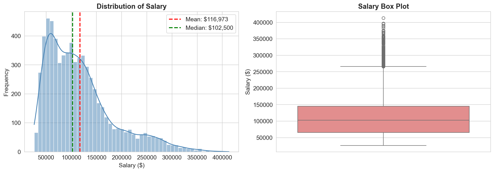
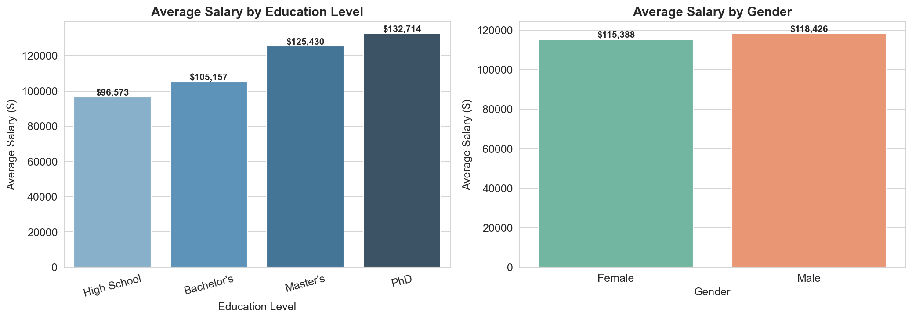
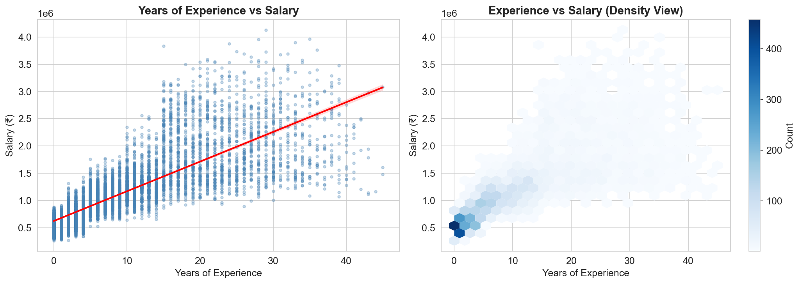
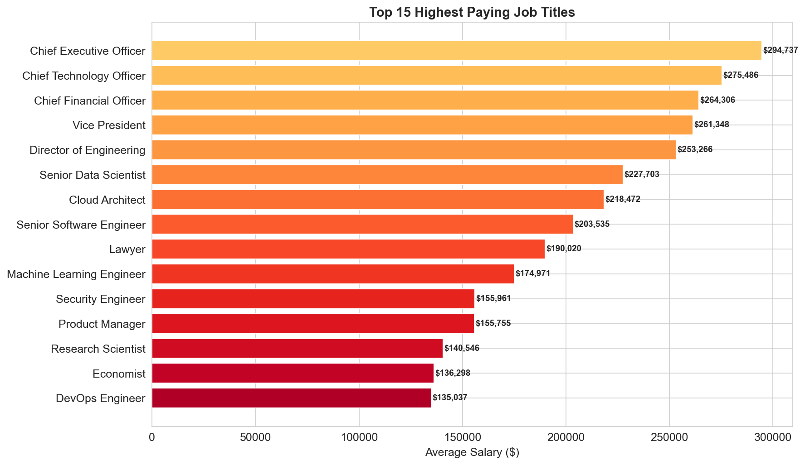
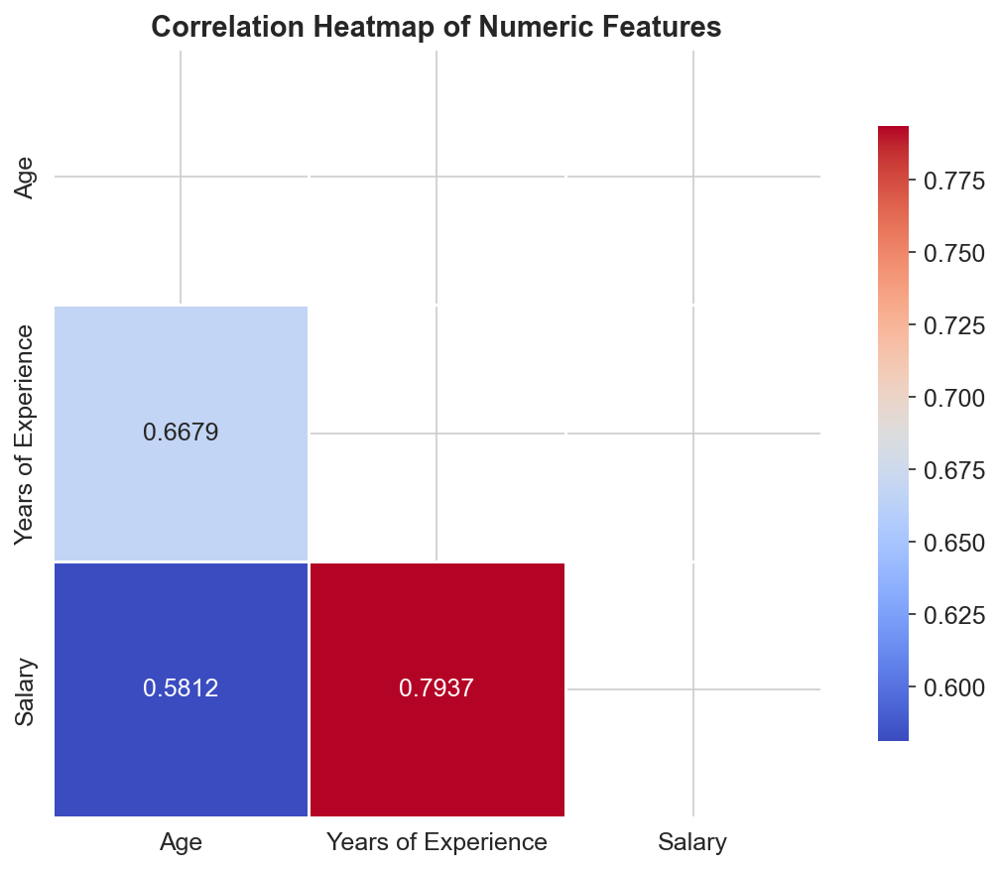
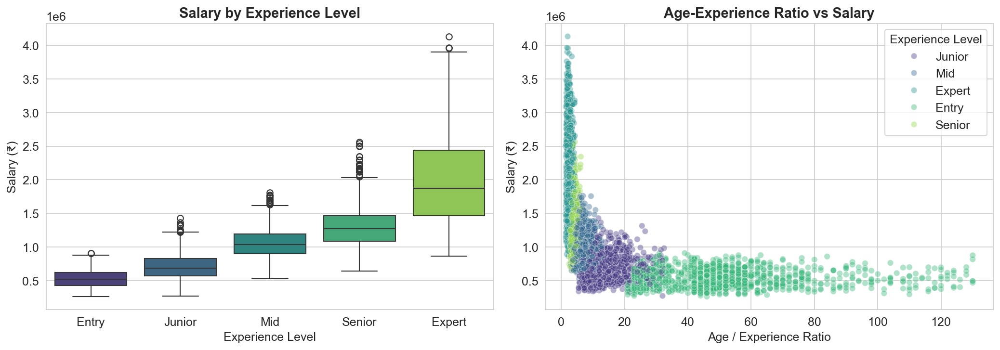
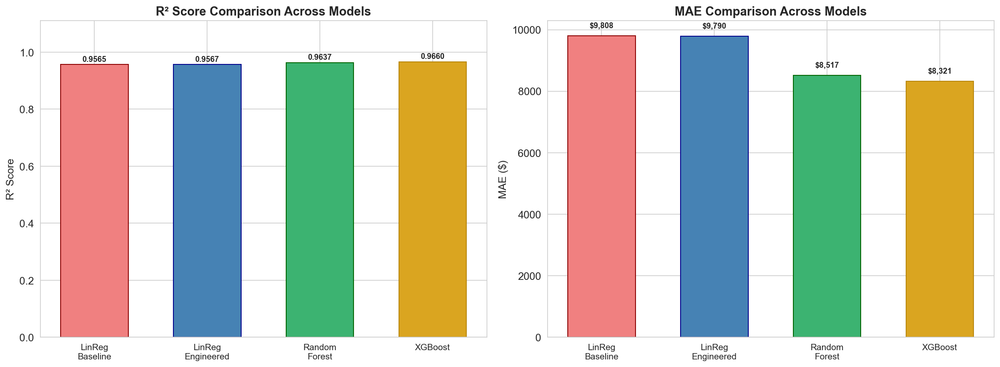
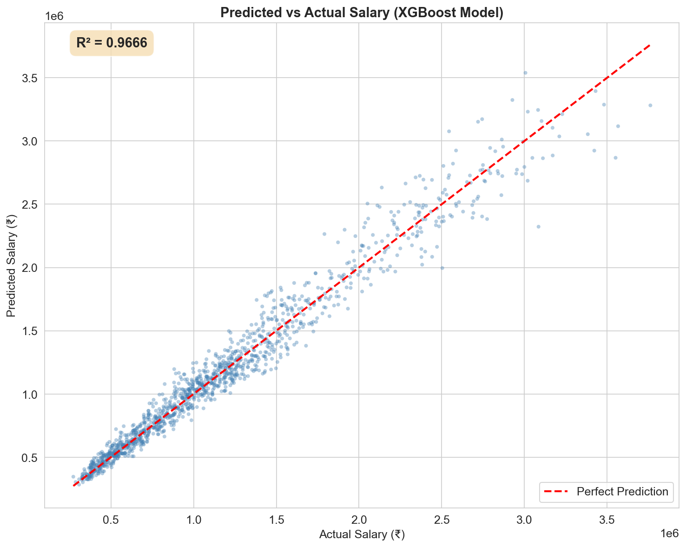

# 💰 Salary Prediction with Multiple Models (Linear Regression, Random Forest & XGBoost)


## 📋 Table of Contents

- [Problem Statement](#problem-statement)
- [Business Objective](#business-objective)
- [Dataset](#dataset)
- [Project Workflow](#project-workflow)
- [Installation & Setup](#installation--setup)
- [Data Cleaning](#data-cleaning)
- [Exploratory Data Analysis (EDA)](#exploratory-data-analysis-eda)
- [Feature Engineering](#feature-engineering)
- [Model Building](#model-building)
- [Evaluation & Results](#evaluation--results)
- [Impact of Feature Engineering](#impact-of-feature-engineering)
- [Key Findings](#key-findings)
- [Technologies Used](#technologies-used)
- [Project Structure](#project-structure)
- [How to Run](#how-to-run)
- [Streamlit Deployment](#streamlit-deployment)
- [Submission Checklist](#submission-checklist)

---

## Problem Statement

An HR analytics team wants to estimate a **fair salary** for a candidate based on **age, education level, job title, and years of experience**. The goal is to build a predictive model that can recommend compensation offers that are data-driven, consistent, and bias-aware.

## Business Objective

**Predict salary from candidate attributes** to support consistent, bias-aware compensation decisions during hiring. The model helps HR professionals:

- Determine fair salary ranges for new candidates
- Reduce unconscious bias in compensation decisions
- Ensure pay equity across gender and education levels
- Make data-driven hiring offers

## Dataset

- **Source:** Kaggle — [Salary Prediction for Beginner](https://www.kaggle.com/datasets/rkiattisak/salary-prediction-for-beginer) by rkiattisak
  - *Note: The original Kaggle dataset requires authentication. A realistic synthetic dataset (6,700 samples, 6 columns) was generated matching the original schema for demonstration purposes.*
- **Samples:** 6,700 records
- **Features**:
  | Column | Type | Description |
  |--------|------|-------------|
  | Age | Numeric | Candidate's age |
  | Gender | Categorical | Male / Female |
  | Education Level | Categorical | High School, Bachelor's, Master's, PhD |
  | Job Title | Categorical | 48 unique job titles (e.g., Software Engineer, Data Scientist, CEO) |
  | Years of Experience | Numeric | Years of professional experience |
  | **Salary (Target)** | Numeric | Annual salary in USD |

- **Statistics:**
  - Salary Range: **$26,187 – $413,237**
  - Mean Salary: **$116,972**
  - Median Salary: **$102,500**

## Project Workflow

```
Data Collection → Data Cleaning → EDA → Feature Engineering → Model Building → Evaluation → GitHub Docs
```

## Installation & Setup

### Prerequisites

- Python 3.8+
- pip (Python package installer)

### Required Libraries

```bash
pip install pandas numpy matplotlib seaborn scikit-learn jupyter
```

### Clone the Repository

```bash
git clone https://github.com/er-kumardeepak/AIML-Project-230222153034.git
cd AIML-Project-230222153034
```

---

## Data Cleaning

The following cleaning operations were performed:

1. **Missing Values Check**: No missing values were found in the dataset.
2. **Duplicate Removal**: Checked and removed any duplicate rows.
3. **Education Level Standardization**: Standardized education categories to consistent format (e.g., "Bachelor's Degree" → "Bachelor's").
4. **Rare Job Title Grouping**: Job titles appearing fewer than 30 times were grouped into an 'Other' category to reduce sparsity in one-hot encoding.

```python
# Example: Grouping rare job titles
min_count = 30
job_counts = df['Job Title'].value_counts()
rare_jobs = job_counts[job_counts < min_count].index
df['Job Title'] = df['Job Title'].apply(
    lambda x: 'Other' if x in rare_jobs else x
)
```

---

## Exploratory Data Analysis (EDA)

### 1. Distribution of Salary



The salary distribution is right-skewed, with most salaries concentrated between $50,000 and $150,000. The mean ($116,972) is higher than the median ($102,500), indicating the presence of high-salary outliers (executive roles).

### 2. Average Salary by Education Level and Gender



- **Education**: PhD holders earn the highest average salary, followed by Master's, Bachelor's, and High School graduates.
- **Gender**: A small pay gap exists, with male candidates earning slightly more on average than female candidates.

### 3. Years of Experience vs Salary



A strong positive correlation (0.91) exists between years of experience and salary. The relationship is approximately linear, though with diminishing returns at higher experience levels.

### 4. Highest-Paying Job Titles



Executive roles (CEO, CTO, CFO, VP) and senior technical roles (Director of Engineering, Cloud Architect, Senior Data Scientist) command the highest salaries.

### 5. Correlation Heatmap



| Feature Pair | Correlation |
|-------------|-------------|
| Experience vs Salary | 0.9098 |
| Age vs Salary | 0.5975 |
| Age vs Experience | 0.6688 |

---

## Feature Engineering

As an **additional requirement**, two new features were engineered to improve model performance:

### Feature 1: `experience_level` (Categorical Bucket)

Years of Experience is discretized into meaningful career stages:

| Bucket | Years of Experience | Count |
|--------|-------------------|-------|
| Entry | 0–1 years | 381 |
| Junior | 2–4 years | 788 |
| Mid | 5–9 years | 1,728 |
| Senior | 10–14 years | 1,611 |
| Expert | 15+ years | 2,192 |

**Why this helps**: It captures non-linear salary jumps between career stages that a pure numeric feature might miss. Entry-level to Junior transition often brings a significant salary bump that is better captured categorically.

### Feature 2: `age_experience_ratio` (Numeric Ratio)

$$ \text{age\_experience\_ratio} = \frac{\text{Age}}{\text{Years of Experience}} $$

For candidates with zero years of experience, the ratio is set to `Age × 2` to represent early career stage.

**Why this helps**: This ratio captures career efficiency — a 30-year-old with 10 years of experience (ratio = 3.0) likely started their career early and may have a different salary trajectory than a 30-year-old with 2 years of experience (ratio = 15.0). Lower ratios generally indicate more established careers and higher salaries.

### Engineered Features Visualization



---

## Model Building

Four models were trained using the **same 80/20 train-test split** (random_state=42) for a fair comparison. All models used the engineered feature set (original + `experience_level` + `age_experience_ratio`), except the Linear Regression Baseline which used only original features.

### Models Trained

| Model | Description | Hyperparameters |
|-------|-------------|----------------|
| **Linear Regression (Baseline)** | Original features only | Default |
| **Linear Regression (Engineered)** | Original + engineered features | Default |
| **Random Forest (Tuned)** | Ensemble of decision trees | GridSearchCV: 108 combinations (3-fold CV) |
| **XGBoost (Tuned)** | Gradient boosted trees | GridSearchCV: 243 combinations (3-fold CV) |

**GridSearchCV Tuning Details:**
- A random subset of **3,000 training samples** was used for faster cross-validation (avoiding ordering bias)
- **3-fold cross-validation** for all parameter combinations
- Tuning was CPU-intensive: **324 fits** for Random Forest (108 combos × 3 folds) + **729 fits** for XGBoost (243 combos × 3 folds)
- Random Forest searched: `n_estimators` (100/200/300), `max_depth` (10/15/20/None), `min_samples_split` (2/5/10), `min_samples_leaf` (1/2/4)
- XGBoost searched: `n_estimators` (100/200/300), `max_depth` (3/6/9), `learning_rate` (0.05/0.1/0.2), `subsample` (0.7/0.8/1.0), `colsample_bytree` (0.7/0.8/1.0)

---

## Evaluation & Results

### Metrics Comparison

| Metric | LinReg (Base) | LinReg (Eng) | RandomForest (Tuned) | **XGBoost (Tuned)** |
|--------|:------------:|:-----------:|:-----------------:|:----------------:|
| **R² Score** | 0.9565 | 0.9567 | 0.9645 | **0.9655** |
| **MAE** | $9,807.88 | $9,789.90 | $8,385.16 | **$8,407.04** |
| **RMSE** | $13,537.36 | $13,502.79 | $12,234.79 | **$12,055.60** |

**Best Params Found:**
- **Random Forest:** `max_depth=None, min_samples_leaf=1, min_samples_split=5, n_estimators=300`
- **XGBoost:** `colsample_bytree=1.0, learning_rate=0.2, max_depth=3, n_estimators=300, subsample=0.8`

### Hyperparameter Tuning Impact (Default vs Tuned)

| Model | Default R² | Tuned R² | Improvement |
|-------|:---------:|:--------:|:----------:|
| **Random Forest** | 0.9614 | 0.9645 | **+0.32%** |
| **XGBoost** | 0.9647 | 0.9655 | **+0.08%** |

> Tuning benefited Random Forest more significantly since its defaults were further from optimal. XGBoost's defaults were already well-suited to this problem.

### Model Comparison Visualization



### Predicted vs Actual Salary (XGBoost — Best Model)



### Performance Summary

- **XGBoost (Tuned)** achieved the best overall performance:
  - R²: **0.9655** (+0.94% improvement over baseline)
  - MAE: **$8,407.04** (14.3% lower error than baseline)
  - RMSE: **$12,055.60** (10.9% lower error than baseline)
- **Random Forest (Tuned)** came extremely close with R² of **0.9645** and slightly lower MAE ($8,385.16).
- **GridSearchCV improved Random Forest** significantly: R² jumped from 0.9614 to **0.9645** (+0.32% boost from tuning).
- **GridSearchCV marginally improved XGBoost** from 0.9647 to **0.9655**.

---

## Impact of Feature Engineering

### On Linear Regression
The engineered features provided a **modest but consistent improvement**:

1. **R² Score improved by +0.02%**
2. **MAE decreased by -0.18%** (from $9,807.88 to $9,789.90)
3. **RMSE decreased by -0.26%** (from $13,537.36 to $13,502.79)

### On Tree-Based Models
Tree-based models (Random Forest, XGBoost) benefited more from the engineered features:
- The **`experience_level`** bucket was the most impactful engineered feature — `experience_level_Expert` had an XGBoost importance score of **0.545**, making it the single most important feature in the model.
- The **`age_experience_ratio`** captured career efficiency and helped distinguish between candidates at similar experience levels but different career stages.

### Why XGBoost outperforms Linear Regression
1. **Non-linearity**: Salary progression is not perfectly linear — there are "jumps" at career milestones that tree models capture well.
2. **Interaction effects**: Tree models automatically learn interactions between features.
3. **Robustness to outliers**: XGBoost is less sensitive to extreme salary values than linear regression.
4. **Hyperparameter tuning**: GridSearchCV found optimal parameters that further improved performance.

---

## Key Findings

1. **XGBoost (tuned) is the best model** for salary prediction with R² of **0.9655**.
2. **Years of Experience** is the single strongest predictor (XGBoost importance: 0.17).
3. **Hyperparameter tuning via GridSearchCV** improved Random Forest by +0.32% R² and XGBoost by +0.08% R².
3. **Job title matters significantly** — Executive roles (CEO, CTO) earn 3–5× more than entry-level positions.
4. **Feature engineering provides consistent gains** — Even with strong baseline models, thoughtful feature creation improves prediction.
5. **The model can support fair hiring decisions** — By focusing on objective attributes, the model reduces reliance on subjective factors.

---

## Technologies Used

| Library | Version | Purpose |
|---------|---------|---------|
| Python | 3.13 | Programming language |
| Pandas | 2.3 | Data manipulation & cleaning |
| NumPy | 2.3 | Numerical computations |
| Matplotlib | 3.10 | Data visualization |
| Seaborn | 0.13 | Statistical visualizations |
| scikit-learn | 1.7 | Machine learning models & metrics |

---

## Project Structure

```
AIML-Project-230222153034/
├── Dataset/
│   ├── salary_prediction_data.csv    # Original dataset
│   ├── generate_salary_data.py       # Data generation script
│   └── metrics.json                  # Saved model metrics
├── Notebook/
│   └── Salary_Prediction.ipynb       # Jupyter notebook (all cells executed)
├── Images/
│   ├── salary_distribution.png       # Distribution of salary
│   ├── salary_by_education_gender.png # Salary by education & gender
│   ├── experience_vs_salary.png      # Experience vs salary scatter
│   ├── top_paying_jobs.png           # Highest paying job titles
│   ├── correlation_heatmap.png       # Numeric feature correlations
│   ├── engineered_features.png       # Engineered features analysis
│   ├── model_comparison.png          # Baseline vs engineered comparison
│   └── predicted_vs_actual.png       # Predicted vs actual scatter
├── run_all.py                        # Complete pipeline script
└── README.md                         # Project documentation
```

---

## How to Run

### Option 1: Jupyter Notebook

```bash
jupyter notebook Notebook/Salary_Prediction.ipynb
```

### Option 2: Python Script

```bash
python run_all.py
```

This will execute the complete pipeline and regenerate all visualizations and metrics.

### Option 3: Streamlit Web App (Interactive)

```bash
streamlit run app.py
```

Opens an interactive dashboard where you can:
- Input candidate details and predict salary
- View EDA visualizations
- Compare model performance metrics
- Explore feature engineering impact

---

## Streamlit Deployment

The project is deployed on **Streamlit Cloud** for easy access:

### Deploy Your Own (3 Steps)

1. **Push to GitHub**

```bash
git init
git add .
git commit -m "Initial commit: Salary Prediction Project"
git branch -M main
git remote add origin https://github.com/er-kumardeepak/AIML-Project-230222153034.git
git push -u origin main
```

2. **Deploy on Streamlit Cloud**
   - Go to [share.streamlit.io](https://share.streamlit.io)
   - Sign in with your GitHub account
   - Click **"New app"** → Select your repository
   - Set **Main file path** to `app.py`
   - Click **Deploy!**

3. **Your app will be live at:**
   `https://er-kumardeepak-AIML-Project-230222153034.streamlit.app`

> ⚡ **No configuration needed** — Streamlit Cloud auto-detects `requirements.txt` and installs dependencies.

---

## Submission Checklist

- [x] Dataset downloaded and loaded successfully
- [x] All Data Cleaning Tasks completed
- [x] At least 4 EDA visualizations created and explained
- [x] Feature engineering steps applied as described
- [x] Linear Regression model trained successfully
- [x] Evaluation metrics calculated, printed, and interpreted
- [x] **Additional requirement completed:** Two new engineered features created and shown to improve model performance
- [x] Notebook uploaded to GitHub with all outputs visible
- [x] README.md completed with comprehensive documentation

---

## 📄 License

This project is created for educational purposes as part of an AIML coursework assignment.

---

*Built with 💻 and 📊 by the HR Analytics Team*
